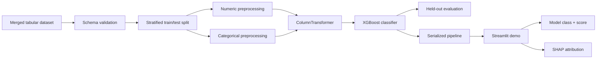

# Diabetes Classification — XGBoost + SHAP

[](https://github.com/alaamadii/diabetes-second-edition/actions/workflows/ci.yml)

An educational Machine Learning project for binary diabetes classification using a reproducible scikit-learn preprocessing pipeline, XGBoost, class-imbalance weighting, SHAP explanations, and a Streamlit demo.

> **Important:** this repository is a portfolio/research project. It is not a medical device, diagnostic system, or clinically validated screening tool. Model outputs must not be used for medical decisions.

## Engineering and ML Highlights

- End-to-end pipeline from tabular data to preprocessing, model training, evaluation, serialization, and interactive inference.
- Numeric missing values are imputed and standardized inside the fitted pipeline.
- Categorical missing values are imputed and one-hot encoded with unknown-category handling.
- Train/test splitting is stratified and deterministic with a fixed random seed.
- XGBoost class weighting is calculated from the training split rather than hard-coded.
- Evaluation reports accuracy, precision, recall, specificity, ROC-AUC, and PR-AUC when score outputs are available.
- SHAP waterfall plots explain feature contributions to individual model outputs.
- Unit tests cover schema validation, splitting, preprocessing, imbalance weighting, and metric calculations.
- GitHub Actions runs linting, formatting checks, source compilation, and tests.

## Architecture



## Dataset Structure and an Important Limitation

The committed `data/merged_diabetes.csv` contains the unified training table used by the current pipeline. The repository's merge script shows that two source datasets were aligned into one schema before concatenation.

The source datasets do **not** originally contain the same measurements. In the merge workflow:

- the smaller dataset is assigned `gender = Female` and lacks `hypertension`, `heart_disease`, `smoking_history`, and `HbA1c_level`;
- the larger dataset lacks `blood_pressure`, `skin_thickness`, `insulin`, and `diabetes_pedigree_function`;
- unavailable values are represented as missing and later imputed by the training pipeline.

This creates a meaningful limitation: missingness patterns can correlate with dataset source, so the combined data should not be treated as if every record was collected under one consistent clinical protocol.

The original download URLs and licensing terms for the two source datasets are not currently documented in this repository. That provenance gap should be resolved before redistribution or any use beyond this educational project.

## Features Used

The current model expects 12 input features:

`gender`, `age`, `hypertension`, `heart_disease`, `smoking_history`, `bmi`, `HbA1c_level`, `blood_glucose_level`, `blood_pressure`, `skin_thickness`, `insulin`, and `diabetes_pedigree_function`.

The binary target column is `diabetes`.

## Training Pipeline

`train_models.py` loads the merged dataset, validates the expected schema, performs a stratified 80/20 train/test split, builds the preprocessing pipeline, calculates `scale_pos_weight` from the **training labels only**, fits XGBoost, prints evaluation metrics, and serializes the complete fitted pipeline to `models/xgboost.pkl`.

The weighting strategy increases the influence of the minority positive class, but it does **not** by itself prove that the default classification threshold is optimal. No separate threshold-tuning set, probability-calibration study, external validation cohort, or prospective clinical validation is included.

## Evaluation

The training script reports:

- Accuracy
- Precision
- Recall / sensitivity
- Specificity
- ROC-AUC
- PR-AUC

Metrics are calculated on the held-out test split created by the repository's current experimental setup. They should be interpreted as **internal experimental results**, not estimates of real-world clinical performance.

The repository previously documented fixed performance numbers such as 88% recall and a fixed class weight. Those claims are intentionally not hard-coded here because the current code computes class weighting from the training data and evaluation results should be regenerated from the actual environment and model version.

## SHAP Explanations

The Streamlit application uses `shap.TreeExplainer` on the fitted XGBoost classifier and displays a waterfall plot for an individual input.

SHAP values describe how model features contributed to a particular model output relative to the explainer baseline. They do not prove causality, medical importance, fairness, or clinical validity.

The score displayed by the application is the classifier's `predict_proba` output. This project does not include calibration analysis, so the score is presented as a **model score**, not as a validated patient-level probability of disease.

## Project Structure

```text
diabetes-second-edition/
├── app/
│   └── app.py                 # Streamlit inference + SHAP demo
├── data/
│   └── merged_diabetes.csv    # Unified experimental dataset
├── models/
│   └── xgboost.pkl            # Serialized fitted pipeline
├── notebooks/
│   └── data_merging.py        # Documents the dataset-alignment workflow
├── src/
│   └── modeling.py            # Schema, preprocessing, split, weighting, metrics
├── tests/
│   └── test_modeling.py       # Deterministic ML helper tests
├── train_models.py            # Main training/evaluation entry point
├── requirements.txt
├── pyproject.toml
└── .github/workflows/ci.yml
```

## Setup

Python 3.10 is used in CI.

```bash
python -m venv .venv
# Windows: .venv\Scripts\activate
# macOS/Linux: source .venv/bin/activate
python -m pip install --upgrade pip
pip install -r requirements.txt
```

## Train the Model

```bash
python train_models.py
```

This regenerates `models/xgboost.pkl` using the current committed dataset and pipeline.

## Run the Demo

```bash
streamlit run app/app.py
```

The interface accepts the model's 12 features and displays the predicted class, an uncalibrated model score when available, and a SHAP contribution plot.

## Quality Checks

```bash
ruff check .
ruff format --check .
python -m compileall -q app src notebooks tests train_models.py
python -m unittest discover -s tests -v
```

GitHub Actions runs the same quality gates on pushes and pull requests.

## Responsible-Use Limitations

This project has several limitations that prevent clinical interpretation:

- no external or prospective validation;
- no probability-calibration analysis;
- no threshold optimization on an independent validation set;
- merged datasets have different original feature availability and likely different collection processes;
- dataset-source missingness may introduce confounding;
- fairness across demographic or clinical subgroups has not been established;
- original source URLs and licensing information still need explicit documentation;
- SHAP explanations describe model behavior, not causal medical relationships.

## Future Improvements

- Document verified source URLs, citations, and licenses for every dataset.
- Preserve dataset-source identifiers and evaluate performance separately by source.
- Add cross-validation and confidence intervals for key metrics.
- Add calibration curves and Brier score before interpreting scores probabilistically.
- Tune decision thresholds on a dedicated validation set rather than the held-out test set.
- Add subgroup/fairness analysis where the data supports it.
- Compare against transparent baselines such as logistic regression.

## Author

**Alaa Madi** — Software Engineering / Machine Learning
